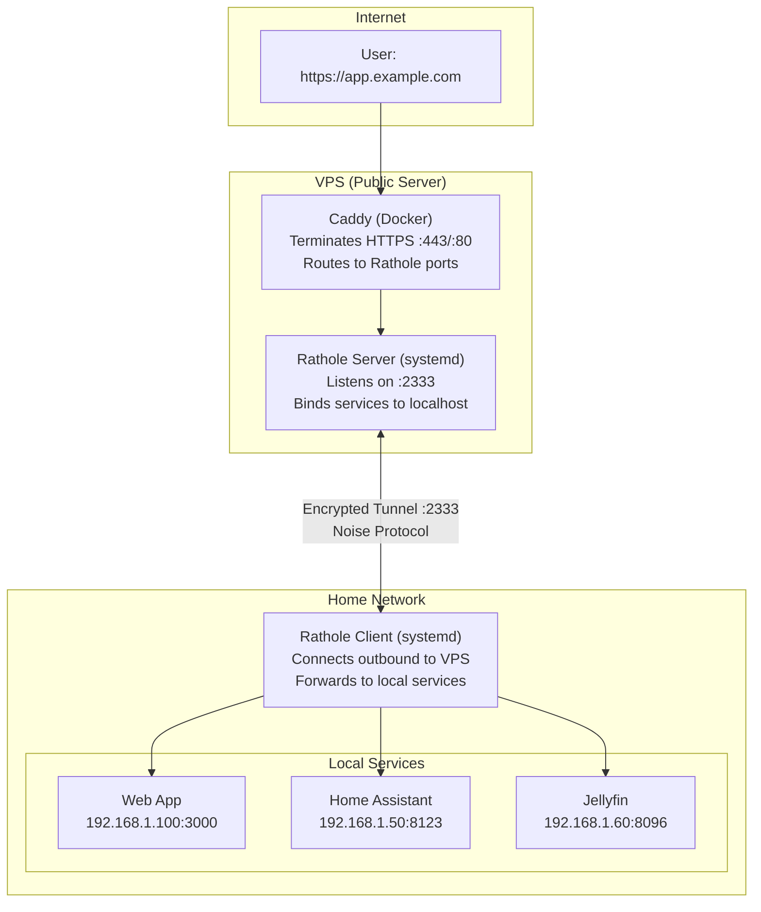
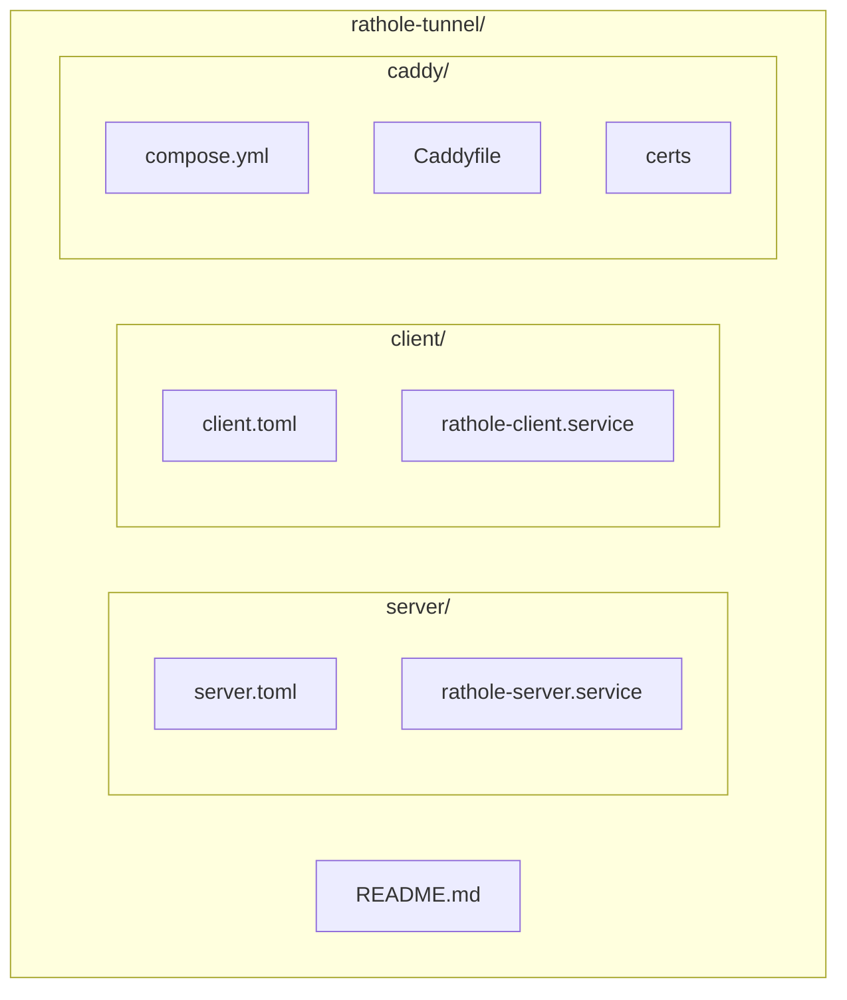

# Rathole + Caddy Tunnel

Securely expose your home network services to the internet through a VPS using [Rathole](https://github.com/rathole-org/rathole) (encrypted TCP tunnel) and [Caddy](https://caddyserver.com/) (reverse proxy with automatic HTTPS).

## Why Use This?

**Problem:** You want to access home services (Home Assistant, Jellyfin, etc.) from anywhere, but:
- Your ISP uses CGNAT or blocks incoming connections
- You don't want to expose your home IP address
- You need reliable HTTPS with valid certificates

**Solution:** This setup creates an encrypted tunnel from your home network to a cheap VPS, which handles all incoming traffic.

## How It Works


```mermaid
flowchart TB
    subgraph Internet
        USER["User: https://app.example.com"]
    end

    subgraph VPS["VPS (Public Server)"]
        CADDY["Caddy (Docker)<br/>Terminates HTTPS :443/:80<br/>Routes to Rathole ports"]
        RATHOLE_SERVER["Rathole Server (systemd)<br/>Listens on :2333<br/>Binds services to localhost"]
        CADDY --> RATHOLE_SERVER
    end

    subgraph HomeNetwork["Home Network"]
        RATHOLE_CLIENT["Rathole Client (systemd)<br/>Connects outbound to VPS<br/>Forwards to local services"]

        subgraph Services["Local Services"]
            WEBAPP["Web App<br/>192.168.1.100:3000"]
            HA["Home Assistant<br/>192.168.1.50:8123"]
            JELLYFIN["Jellyfin<br/>192.168.1.60:8096"]
        end

        RATHOLE_CLIENT --> WEBAPP
        RATHOLE_CLIENT --> HA
        RATHOLE_CLIENT --> JELLYFIN
    end

    USER --> CADDY
    RATHOLE_SERVER <--->|"Encrypted Tunnel :2333<br/>Noise Protocol"| RATHOLE_CLIENT
```

## Management Apps

Automate config management with these CLI tools:

| App | Description | Install |
|-----|-------------|---------|
| **[RCM-Go](https://github.com/AhmedAburady/rcm-go)** (Recommended) | Single binary with interactive TUI | `go install github.com/AhmedAburady/rcm-go/cmd/rcm@latest` |
| [RCM (Python)](https://github.com/AhmedAburady/rcm) | Original Python version | `uv tool install "rcm @ git+ssh://git@github.com/AhmedAburady/rcm.git"` |

Both apps use your **Caddyfile as the source of truth** - edit one file and run `rcm sync` to deploy configs to both machines automatically.

## Project Structure


```mermaid
flowchart TD
    subgraph repo["rathole-tunnel/"]
        subgraph server_dir["server/"]
            ST[server.toml]
            SS[rathole-server.service]
        end
        subgraph client_dir["client/"]
            CT[client.toml]
            CS[rathole-client.service]
        end
        subgraph caddy_dir["caddy/"]
            DC[compose.yml]
            CF[Caddyfile]
            CERTS[certs]
        end
        
        README[README.md]
    end

```


## Prerequisites

- **VPS**: Any Linux server with a public IP (e.g., Hetzner, DigitalOcean, Vultr)
- **Home machine**: Any always-on Linux device on your home network
- **Domain**: Point your domain's DNS to your VPS IP
- **Docker**: Required on VPS for Caddy (or install Caddy directly)

## Quick Start

### 1. Install Rathole

Run this on **both** VPS and home machine:

```bash
wget https://github.com/rathole-org/rathole/releases/download/v0.5.0/rathole-x86_64-unknown-linux-gnu.zip
unzip rathole-x86_64-unknown-linux-gnu.zip
sudo mv rathole /usr/local/bin/
sudo chmod +x /usr/local/bin/rathole
rathole --version
```

### 2. Generate Keys and Token

Run once on either machine:

```bash
# Generate keypair
rathole --genkey
# Output:
# Private Key: xxxxx (use on server)
# Public Key: yyyyy (use on client)

# Generate token
openssl rand -base64 32
```

Save these values - you'll need them for both configs.

### 3. VPS Setup

```bash
# Clone this repo
git clone https://github.com/YOUR_USERNAME/rathole-tunnel.git
cd rathole-tunnel

# Edit server config with your keys
nano server/server.toml
# Replace: YOUR_TOKEN_HERE, YOUR_PRIVATE_KEY_HERE
# Configure your services (bind_addr ports)

# Install config into /etc/rathole
sudo mkdir -p /etc/rathole
sudo cp server/server.toml /etc/rathole/server.toml
sudo chmod 644 /etc/rathole/server.toml

# Install and start the systemd service
sudo cp server/rathole-server.service /etc/systemd/system/
sudo systemctl daemon-reload
sudo systemctl enable --now rathole-server

# Verify it's running
sudo systemctl status rathole-server
```

#### Setup Caddy

```bash
cd caddy

# Edit Caddyfile with your domains
nano Caddyfile

# If using Cloudflare origin certs, add them to certs/
mkdir -p certs
# Copy your cert.pem and key.pem files here

# Start Caddy
docker compose up -d

# Check logs
docker compose logs -f
```

#### Configure Firewall

```bash
sudo ufw allow 22/tcp
sudo ufw allow 80/tcp
sudo ufw allow 443/tcp
sudo ufw allow from YOUR_HOME_IP to any port 2333
sudo ufw enable
```

### 4. Home Network Setup

```bash
# Clone this repo
git clone https://github.com/YOUR_USERNAME/rathole-tunnel.git
cd rathole-tunnel

# Edit client config
nano client/client.toml
# Replace: YOUR_VPS_IP, YOUR_TOKEN_HERE, YOUR_SERVER_PUBLIC_KEY_HERE
# Configure your services (local_addr = your service IPs)

# Install config into /etc/rathole
sudo mkdir -p /etc/rathole
sudo cp client/client.toml /etc/rathole/client.toml
sudo chmod 644 /etc/rathole/client.toml

# Install and start the systemd service
sudo cp client/rathole-client.service /etc/systemd/system/
sudo systemctl daemon-reload
sudo systemctl enable --now rathole-client

# Verify connection
sudo journalctl -u rathole-client -f
# Should show: "Control channel established"
```

## Adding a New Service

### Option 1: Use RCM (Recommended)

Use **[RCM-Go](https://github.com/AhmedAburady/rcm-go)** or **[RCM (Python)](https://github.com/AhmedAburady/rcm)** to automate the entire process. Just edit your Caddyfile and run one command:

```bash
rcm sync
```

RCM parses your Caddyfile, generates both `server.toml` and `client.toml`, deploys them via SSH, and restarts all services automatically.

### Option 2: Manual

1. **Server** (`server/server.toml`):
   ```toml
   [server.services.myapp]
   bind_addr = "127.0.0.1:5003"
   ```

2. **Client** (`client/client.toml`):
   ```toml
   [client.services.myapp]
   local_addr = "192.168.1.X:PORT"
   ```

   > Service names must match exactly!

3. **Caddy** (`caddy/Caddyfile`):
   ```caddyfile
   myapp.example.com {
       reverse_proxy 127.0.0.1:5003
   }
   ```

4. **Re-deploy configs and restart services**:

   > Configs are **copied** into `/etc/rathole/` (not symlinked), so re-copy after editing.

   ```bash
   # VPS
   sudo cp server/server.toml /etc/rathole/server.toml
   sudo chmod 644 /etc/rathole/server.toml
   sudo systemctl restart rathole-server
   cd ~/rathole-tunnel/caddy && docker compose restart

   # Home
   sudo cp client/client.toml /etc/rathole/client.toml
   sudo chmod 644 /etc/rathole/client.toml
   sudo systemctl restart rathole-client
   ```

## TLS Certificate Options

### Option 1: Let's Encrypt (Automatic)

Best for: DNS pointing directly to VPS (Cloudflare "DNS only" / grey cloud)

```caddyfile
app.example.com {
    reverse_proxy 127.0.0.1:5000
}
```

Caddy automatically obtains and renews certificates.

### Option 2: Cloudflare Origin Certificates

Best for: Traffic proxied through Cloudflare (orange cloud)

1. Generate origin cert in Cloudflare dashboard (SSL/TLS > Origin Server)
2. Save as `caddy/certs/domain-cert.pem` and `caddy/certs/domain-key.pem`
3. Configure Caddyfile:
   ```caddyfile
   app.example.com {
       tls /certs/domain-cert.pem /certs/domain-key.pem
       reverse_proxy 127.0.0.1:5000
   }
   ```

## App-Specific Configuration

### Home Assistant

Add to `configuration.yaml`:
```yaml
http:
  use_x_forwarded_for: true
  trusted_proxies:
    - 127.0.0.1
    - 192.168.1.0/24  # Your home network range
```

## Useful Commands

```bash
# === VPS ===
sudo systemctl status rathole-server
sudo systemctl restart rathole-server
sudo journalctl -u rathole-server -f

cd ~/rathole-tunnel/caddy
docker compose logs -f
docker compose restart
docker compose pull && docker compose up -d  # Update Caddy

# === Home ===
sudo systemctl status rathole-client
sudo systemctl restart rathole-client
sudo journalctl -u rathole-client -f
```

## Troubleshooting

| Problem | Solution |
|---------|----------|
| Client won't connect | Check VPS firewall allows port 2333 from your home IP |
| "Token mismatch" | Ensure `default_token` is identical in both configs |
| "Invalid public key" | Verify `remote_public_key` in client matches server's public key |
| 502 Bad Gateway | Service not running, wrong `local_addr`, or service name mismatch |
| Certificate errors (Let's Encrypt) | Ensure DNS points to VPS, port 80 is open |
| Certificate errors (Cloudflare) | Check cert files exist and paths are correct |

## Security Notes

- **Encryption**: All tunnel traffic uses Noise Protocol (ChaCha20-Poly1305 + X25519)
- **Firewall**: Restrict port 2333 to your home IP only
- **Secrets**: Never commit real tokens/keys - the example configs use placeholders
- **Cloudflare certs**: Valid for 15 years, no auto-renewal needed
- **Let's Encrypt**: Caddy handles renewal automatically

### systemd Hardening

Both `rathole-server.service` and `rathole-client.service` ship with a sandbox profile that drops privileges and shrinks the kernel attack surface:

| Directive | Effect |
|-----------|--------|
| `DynamicUser=yes` | Runs under a transient, unprivileged user (no static account, no home) |
| `NoNewPrivileges=yes` | Process can never gain new privileges (e.g. via setuid) |
| `ProtectSystem=strict` | Entire filesystem mounted read-only except a few runtime paths |
| `PrivateTmp=yes` | Private `/tmp` and `/var/tmp`, isolated from other processes |
| `ProtectKernelTunables=yes` | Blocks writes to `/proc/sys`, `/sys`, etc. |
| `ProtectKernelModules=yes` | Denies loading/unloading kernel modules |
| `ProtectControlGroups=yes` | `/sys/fs/cgroup` is read-only |
| `RestrictAddressFamilies=AF_INET AF_INET6` | Only IPv4/IPv6 sockets allowed |
| `RestrictNamespaces=yes` | Blocks creation of new namespaces |
| `LockPersonality=yes` | Prevents changing execution domain |
| `CapabilityBoundingSet=` | Drops all Linux capabilities |
| `SystemCallFilter=@system-service` | Allows only the standard service syscall set |
| `SystemCallErrorNumber=EPERM` | Denied syscalls return `EPERM` instead of killing the process |

After editing a unit, reload and restart:

```bash
sudo systemctl daemon-reload
sudo systemctl restart rathole-server   # or rathole-client
```

Inspect the applied sandbox at any time with `systemd-analyze security rathole-server`.

### Config File Handling

The `server.toml` / `client.toml` configs live in `/etc/rathole/` (root-owned). Because the services run as a `DynamicUser`, the files are world-readable (`644`) so the transient user can read them at startup.

> ⚠️ **Note:** `644` means any local user can read these files, which contain your tunnel token and (on the server) the private key. On a single-admin VPS this is acceptable. If untrusted users have shell access, tighten to `640` with a dedicated group and set `Group=` / `SupplementaryGroups=` on the unit (incompatible with `DynamicUser`), or use systemd `LoadCredential=` to inject secrets instead.

## License

MIT
